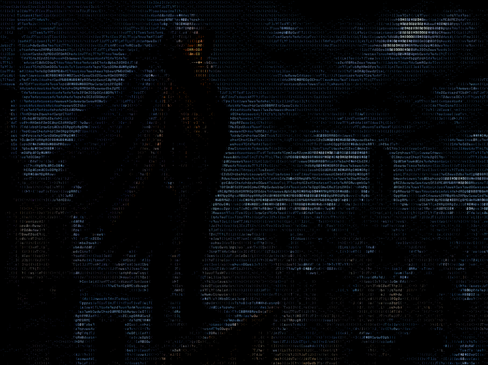

<h1 align="center">The Cataclysm<small> 
    Its been about two months since the end of the world. 
    It was not just one apocalypse that hit; it was multiple, all at once. 
    Now they call it "The Cataclysm", and your shelter is no longer safe.
</small></h1>

  

    Zombies are just the surface of what you will end up dealing with as you venture out into the strangely flat land of former America. 
    Scavenge the area for food, equipment, maybe even a working car with gas. 
    Run into and away from hordes of the undead, mutated insects... and robots? 
    <b><i>There is a lot to handle. And you have a lot to learn about how the world has changed.</b></i> 
    There are skills to develop, martial arts to learn, contraptions to build, friends to meet, and horrors to run like hell from. 
    Choose to live as a nomad or fortify yourself in a safehouse. Recruit some followers or go it alone. 
    Live as a low-tech stalker, a tricked-out cyborg, a twisted mutant monstrosity. 
    <b><i>You might not get much of a choice for the last one...</i></b> 

<h1>
    Salvaged Changelog 
    <small><i>Version 0.1 release</i></small>
</h1>

    <b><i>Electronics and Data</i></b> 
    Old systems going back over 10 years for electronic data ranging from photos, recipes, and ebooks are reworked. 
    <b><i>Cybernetics</i></b> 
    Cybernetics has been modified a bit to be more mod friendly with bigger overhauls planned. 
    <b><i>Advanced Tailoring</i></b> 
    Advanced tailoring to uparmor clothing has been brought back, but is not balanced, 
    <b><i>Metal Recycling</i></b> 
    The Steel Mill's metal recycler has been reworked and restored, now requiring a source of power, and made mod friendly. 
    <b><i>Item Spawning</i></b> 
    Spawnlists have been reworked. 
    <b><i>Git Infrastructure</i></b> 
    Massively reworked for a different hosting architecture than github and partially modernized based on DDA upstream. 

        
<h1>Gameplay</h1>

<b>Cataclysm is a top-down tileset game where your every actions is measured against the flow of time.</b> 
This means that unless you are moving or doing something (even pressing the wait key) time doesn't move. 
In the open world this may feel a bit odd, but you will be thankful for the time to think and choose your actions carefully once you kick the hornets nest (sometimes literally) and suddenly have to pick your actions carefully to have a chance at survival. 
<i>You will have to run. 
You will have to sneak. 
You will have to scout ahead and judge the risks.</i> 
There will be things you don't understand. Knowledge you will have to build both within the game and personally. 
Becoming a ridiculous survivor capable of taking on the Cataclysm is possible, but takes a long time to reach. 
And even the strongest and most broken of builds can be brought down by misfortune and RNG. 
<b>So be prepared.</b>

<h1>Supported Platforms</h1>
Cataclysm tends to come in two main builds (with further options) Curses, and Tiles. The curses build is a barebones no-sound and no-graphics version where everything is in ASCII characters. Its the same game, but stripped down heavily. Tiles gives you more modern options with its tileset packs. There are a number of tilesets available to add to the game, and by default it will release and compile with several of the most popular. 
The end result is that the game traditionally is supported on many Windows and Linux releases, as well as macOS and Android. 
Salvaged is a work in progress, and is currently tested and built for Windows and Linux. 
Given time it will likely run into gaps where the current tilesets no longer support everything I add to it, but not now.

<h1>Downloads</h1>
At some point I will have the github publishing official releases on a rotating cycle. I don't have my own websites to host my versions of the large support network of documents C:DDA has, and may resort to shipping them with the repository. Fortunately, keeping them text makes them easily compressible. 
-REWORK THIS LATER 
-SEE ABOUT ROTATING RELEASE PUBLISHING 

<h1>Compiling</h1>
So far this should be compilable on linux or windows via gcc, clang, cmake, MSYS2, and vcpkg. The testing matrix runs every time I merge experimental's branch into master for a release, and it builds the game a number of ways across a number of build options. 
-PUBLISH SUPPORTED BUILDS EVENTUALLY 
-LIST BUILD GUIDE EVENTUALLY 
-PUBLISH TESTS EVENTUALLY 

Please read [COMPILING.md](doc/COMPILING/COMPILING.md) - it covers general information and more specific recipes for Linux, OS X, Windows and BSD. See [COMPILER_SUPPORT.md](doc/COMPILING/COMPILER_SUPPORT.md) for details on which compilers we support. And you can always dig for more information in [doc/](https://github.com/CDDAHackJob/Cataclysm-Salvaged/tree/master/doc).

We also have the following build guides:
* Building on Windows with `MSYS2` at [COMPILING-MSYS.md](doc/COMPILING/COMPILING-MSYS.md)
* Building on Windows with `vcpkg` at [COMPILING-VS-VCPKG.md](doc/COMPILING/COMPILING-VS-VCPKG.md)
* Building with `cmake` at [COMPILING-CMAKE.md](doc/COMPILING/COMPILING-CMAKE.md)  (*unofficial guide*)

<h1>Other Versions</h1>
When you have an open source project go on for 15 years with thousands of contributors, people inevitably split on opinions on where to go.
Cataclysm: Salvaged is my own fork and will be a solo project to take the game in the direction I choose. I am a scavenger intent on sifting through the scraps and piecing together what I think is fun. 
Anything I have is free to take per the licenses; just take a mention of me along with you. 
I will be doing the same for what I take from others. 
Below are some inaccurate summaries of the main branches:

<h3>DDA - <a href="https://github.com/cleverraven/cataclysm-dda">Dark Days Ahead</a> by TheDarklingWolf</h3>
Cataclysm: Dark Days ahead is the oldest and biggest version of the game, and the source of all other branches. Its maintainers did the most to build things up, but eventually disagreements saw the other branches emerge. It seeks to discard the scifi and power of the old days, and make the setting more current and grittier, more focused on survival mechanics. It wants to be more like project Zomboid these days, and some heavy-handed deletions of old sections instead of fixing them saw it lose some support, causing TLG to emerge and Bright Nights to gain more popularity. 
Despite all this, it has the biggest community, the most history, the most documentation, and for a long time was the most developed and polished.
Every guide you will see on how to compile, troubleshoot, mod, and play Cataclysm will most likely originate from Dark Days Ahead. 

<h3>BN - <a href="https://github.com/cataclysmbn/Cataclysm-BN">Bright Nights</a> by scarf005, RobbieNeko, chaosvolt, and Oren Audeles</h3>
The oldest branch, Cataclysm: Bright Nights originates from DDA's stable 0.D release and seeks to keep the setting as it was back then. Wilder, more scifi, more power for the player to go nuts, and less survival mechanics. For a long time it lagged behind CDDA, but it has seen a surge of development and is a great alternative. 

<h3>TLG - <a href="https://github.com/Cataclysm-TLG/Cataclysm-TLG/">The Last Generation</a> by WormGirl</h3>
The newest branch, The Last Generation is seeing a lot of development and bug fixes, and seems to be positioning itself as a midway point between Dark Days and Bright Nights. It has a steam page just like Dark Days Ahead and I don't know enough about it to mangle a description like I did for the others. 

## Frequently Asked Questions

#### Is there a tutorial?

Yes, you can find the tutorial in the **Special** menu at the main menu (be aware that due to many code changes the tutorial may not function). You can also access documentation in-game via the `?` key.

#### How can I change the key bindings?

Press the `?` key, followed by the `1` key to see the full list of key commands. Press the `+` key to add a key binding, select which action with the corresponding letter key `a-w`, and then the key you wish to assign to that action.

#### How can I start a new world?

**World** on the main menu will generate a fresh world for you. Select **Create World**.

#### I've found a bug. What should I do?

Please submit an issue on [our GitHub page](https://github.com/CDDAHackJob/Cataclysm-Salvaged/issues/) using [bug report template](https://github.com/CDDAHackJob/Cataclysm-Salvaged/issues/new?template=bug_report.md). If you're not able to, send an email to `CDDA_HackJob@protonmail.com`.

#### I would like to make a suggestion. What should I do?

Please submit an issue on [our GitHub page](https://github.com/CDDAHackJob/Cataclysm-Salvaged/issues/) using [feature request template](https://github.com/CDDAHackJob/Cataclysm-Salvaged/issues/new?template=feature_request.md).
